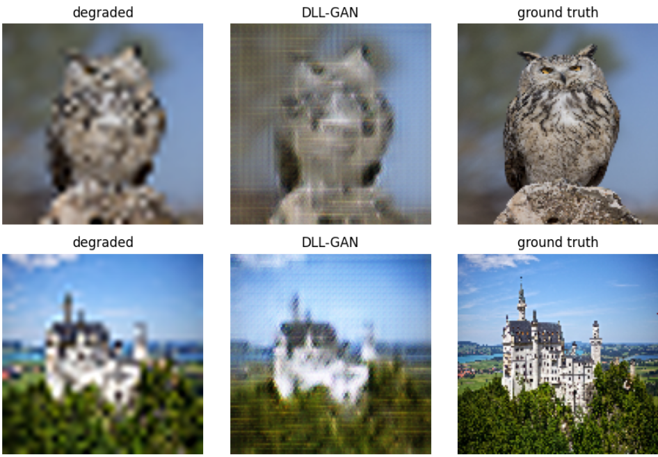
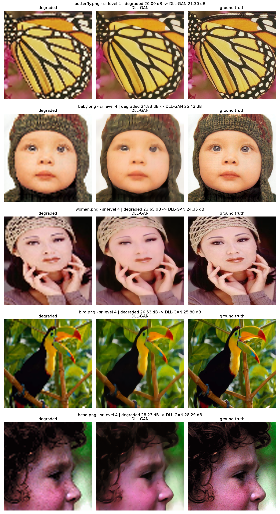

# DLL-GAN — independent PyTorch reimplementation

An independent, from-scratch reimplementation of:

> M. Kas, A. Chahi, I. Kajo, Y. Ruichek. *DLL-GAN: Degradation-level-based learnable adversarial loss for image enhancement.* Expert Systems with Applications, 237, 2023.

The official repository contains figures and a README but no code or weights. This project rebuilds the method from the paper's description, trains it on DIV2K, evaluates it against a bicubic baseline, and documents two issues found along the way and how they were fixed.

> This is not the authors' code and is not affiliated with them. All credit for the method goes to the original authors.

## The idea

A standard image-restoration GAN trains its generator with two signals: a discriminator (does the output look real?) and an L1 loss (is each pixel close to the target?). Neither measures how much degradation is left in the output. DLL-GAN adds a third network: a regressor **R**, pretrained to estimate an image's degradation level (0 = clean), then frozen and used as a loss. The generator is pushed to produce images that R scores as clean, so the loss is learned and specific to the task rather than a hand-designed metric.

| network | role |
|---|---|
| **G**: ResNet generator (9 residual blocks) | restores the degraded image |
| **D**: pixel-wise discriminator (1×1 PatchGAN) | real/fake decision per pixel |
| **R**: ResNet-18 regressor, frozen | estimates remaining degradation → third loss term |

Generator objective (paper Eq. 5): `L_G = L_GAN + λ·L1 + L_R`, with `L_R = mean(R(G(x)))`.

## Two issues found, and what I changed

### 1. The degradation loss is unbounded below

As written in Eq. 6, `L_R = mean(R(G(x)))` has no lower bound. Because R is frozen, the generator can lower this term by making R's estimate go *below* zero, without actually removing degradation. In other words, the generator exploits its own loss. In training, the term drifted steadily negative while high-frequency hatching appeared in the outputs:

| GAN epoch | 1 | 20 | 40 | 60 | 80 |
|---|---|---|---|---|---|
| `L_R` (unbounded, 256 px run) | −0.13 | −0.60 | −0.92 | −1.50 | −1.57 |

**Fix:** clamp each image's estimate at zero (the "clean" level), so going past it earns no reward:

```python
deg = R(fake).clamp(min=0).mean()   # losses.py
```



### 2. Checkerboard artifacts from transposed convolutions

The generator's `ConvTranspose2d` upsampling produced a fine grid texture. This is a known effect of uneven kernel overlap ([Odena et al., 2016](https://distill.pub/2016/deconv-checkerboard/)). **Fix:** I replaced it with resize-convolution (nearest-neighbour `Upsample` followed by a 3×3 `Conv2d`), which removed the pattern.

The evidence for both fixes is qualitative: training curves and visual outputs. A controlled ablation is listed under next steps.

## Results: super-resolution ×4

The model was trained on 800 DIV2K images and evaluated on Set5 and Set14, which it never saw during training. "Bicubic baseline" means the degraded input itself (bicubic down/up-sampling), so it measures what you get with no model at all.

| | Set5 PSNR (dB) | Set5 SSIM | Set14 PSNR (dB) | Set14 SSIM |
|---|---|---|---|---|
| Bicubic baseline | 24.65 | 0.7617 | 20.87 | 0.6174 |
| DLL-GAN (this repo) | **25.03** | **0.7725** | **21.31** | 0.6197 |
| Gain | +0.39 | +0.0109 | +0.44 | +0.0023 |



How to read these numbers:

- **Protocol.** Every image is resized to 256×256 and degraded by bicubic ×4 down/up-sampling at that size. PSNR and SSIM are computed in RGB. This is *not* the standard Set5/Set14 super-resolution protocol (native resolution, Y channel, border crop), so the numbers are not comparable to published tables, including the paper's.
- **Magnitude.** The gain is positive on average but modest. The model scores below the baseline on some individual images (e.g. `bird.png`, −0.73 dB). The Set14 SSIM gain (+0.0023) is within noise.
- **Sample size.** These results come from a single training run with a single seed.

## Training setup

- **Data:** DIV2K train HR (800 images), resized to 256×256, degraded on the fly.
- **Regressor:** ImageNet-pretrained ResNet-18, trained on levels {clean, ×4, ×8, ×16} as indices 0–3, with MSE loss. Adam, lr 1e-4, batch 32, 8 epochs.
- **GAN:** trained on ×4 only. Adam, lr 2e-4, β = (0.5, 0.999), batch 8, 150 epochs. Loss weights: λ_GAN = 1, λ_L1 = 100, λ_R = 1.
- **Hardware:** a single NVIDIA T4 (Google Colab free tier).

## Deviations from the paper

- `L_R` is clamped at 0 (fix 1).
- Resize-convolution replaces transposed convolution in the generator (fix 2).
- The paper does not report the L1 weight λ, so I use 100 (the pix2pix convention).
- The working resolution is 256×256 instead of 480×480. The regressor is trained on the same 800 DIV2K images (the paper uses 500).
- The adversarial loss is implemented as BCE on the discriminator's per-pixel logit map.

## Repository structure

| file | role |
|---|---|
| `config.py` | tasks, degradation levels, hyperparameters |
| `degradations.py` | super-resolution / noise / JPEG corruption operators |
| `datasets.py` | leveled dataset for R, paired dataset for the GAN |
| `models.py` | generator (resize-conv), pixel discriminator, ResNet-18 regressor |
| `losses.py` | the three loss terms (with the clamped `L_R`) |
| `train_regressor.py` / `train_gan.py` | step 1 / step 2 training |
| `evaluate.py` | PSNR/SSIM on a benchmark folder, with the bicubic baseline side by side |
| `infer.py` | restore a single image, with optional metrics |
| `smoke_test.py` | checks the whole pipeline on random tensors (no data needed) |
| `notebooks/DLL_GAN_colab.ipynb` | full training pipeline on a free Colab GPU |
| `benchmarks/` | Set5 and Set14 HR images |

## Usage

```bash
conda create -n dllgan python=3.11 -y
conda activate dllgan
pip install torch torchvision   # CPU only: add --index-url https://download.pytorch.org/whl/cpu
pip install -r requirements.txt
python smoke_test.py
```

**Pretrained weights:** download `generator.pth` from the [Releases](../../releases) page and place it in `checkpoints/`.

**Evaluate:**
```bash
python evaluate.py --data_dir benchmarks/Set5_HR --task sr --level 4
```

**Restore one image:**
```bash
python infer.py --image photo.png --ckpt checkpoints/generator.pth --task sr --level 4 --size 256
# add --already-degraded if the input is already low quality
```

**Train:** run `python train_regressor.py`, then `python train_gan.py`. A GPU is recommended; the Colab notebook runs the full pipeline on a free T4.

## Limitations and next steps

- **Controlled ablation.** Train four variants with the same data and budget: (a) GAN + L1 without R, (b) with unclamped R, (c) with clamped R, (d) with resize-conv. This would quantify each change separately. The final model changed the architecture, the data size and the training length at once, so the current results do not isolate the effect of either fix.
- **Standard protocol.** Evaluate at native resolution on the Y channel with border crop, for comparability with published results.
- **Exploiting R within the valid range.** Clamping removes the incentive to go below zero, but the generator can still exploit R above zero. Periodically fine-tuning R on generator outputs, and adding a perceptual metric (LPIPS), would test this.
- **Other tasks.** The denoising and JPEG pipelines are implemented (degradations and regressor levels) but not yet trained or evaluated.

## Author

Abdessamed Britah, engineering student in Data Science & AI, École Nationale Polytechnique d'Alger.
[LinkedIn](#) · abdessamed.britah@g.enp.edu.dz
